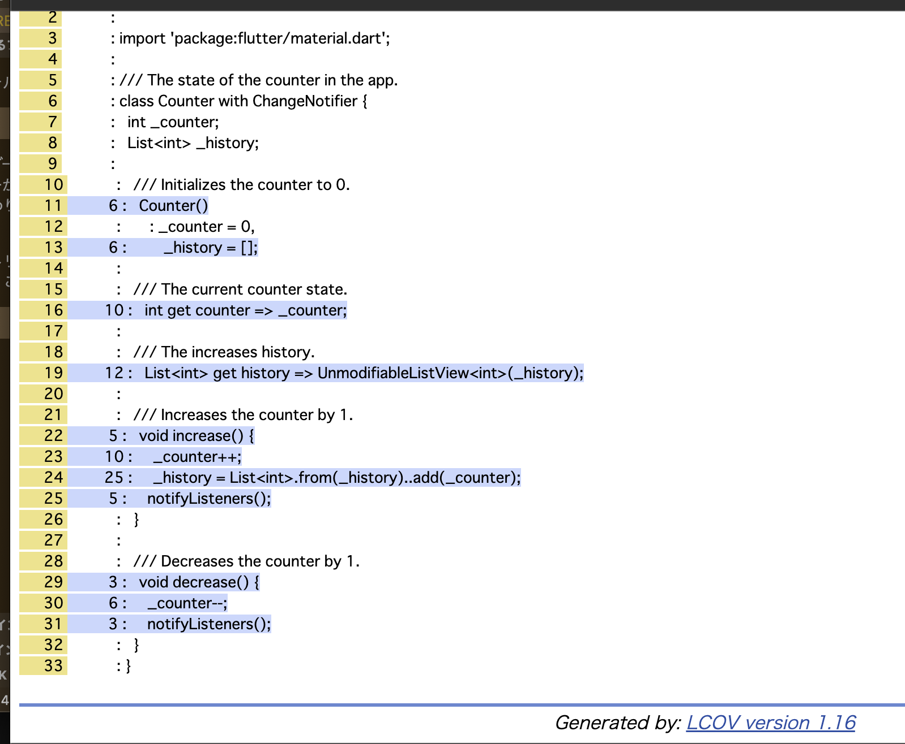

# usage

```zsh
flutter run
./coverate.sh
```

## coverage レポート例





## See

- <https://qiita.com/qiuyin/items/ff8a832f9f6d88c439bc>
  Flutterテストとgithubワークフロー設定の基本

- <https://github.com/zgosalvez/github-actions-report-lcov>
  GitHub Action — Report LCOV

- <https://github.com/VeryGoodOpenSource/very_good_workflows>
  Very Good Workflows

- <https://qiita.com/tokkun5552/items/2eb6793501c152dabf33>
  【Flutter】GitHubActionsでテストと静的解析を自動化する

- https://betterprogramming.pub/creating-a-complete-github-workflow-for-flutter-529f6bd7bb10
  Creating a Complete GitHub Workflow for Flutter

- https://note.com/yt_hizi/n/n107f43dc299b
- Flutter アプリに画像回帰テスト(VRT)を導入する
